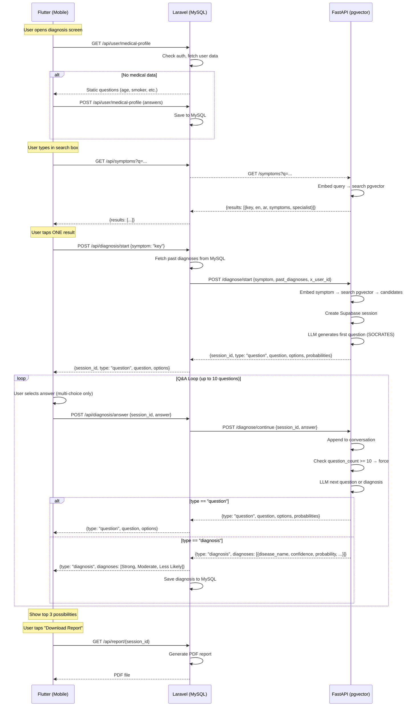

# Diagnosis Flow Diagram

## How to view

- **GitHub/GitLab** — renders automatically
- **VS Code** — install "Markdown Preview Mermaid Support" extension
- **Online** — paste at https://mermaid.live
- **PlantUML** — `docs/diagnosis_flow.puml` for PlantUML-compatible tools
